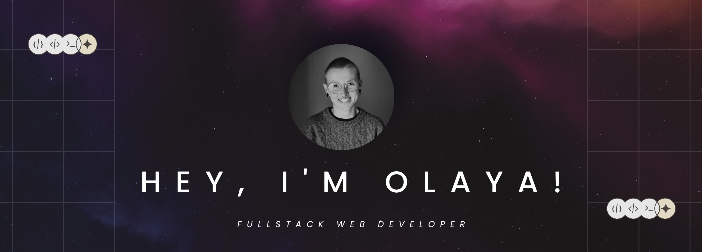

After many years working in the film industry, I have decided to make a change in my career path, finding in the field of programming a new avenue to express myself and continue to grow professionally.

*   🌍  I'm based in Asturias, Spain
*   ✉️  You can contact me at [olaya.saga@gmail.com](mailto:olaya.saga@gmail.com)
*   🧠  I'm currently working at Capgemini as a Software Engineer.
*   🤝  Ready to collaborate on projects that help me grow and continue learning.

### Skills 

                    
### Socials
     

<a href="https://www.github.com/osaga-fu" target="_blank" rel="noreferrer">
<picture>
<source media="(prefers-color-scheme: dark)" srcset="https://raw.githubusercontent.com/danielcranney/readme-generator/main/public/icons/socials/github-dark.svg" />
<source media="(prefers-color-scheme: light)" srcset="https://raw.githubusercontent.com/danielcranney/readme-generator/main/public/icons/socials/github.svg" />

</picture>
</a>
<a href="https://www.linkedin.com/in/olaya-sánchez-dev" target="_blank" rel="noreferrer">
<picture>
<source media="(prefers-color-scheme: dark)" srcset="https://raw.githubusercontent.com/danielcranney/readme-generator/main/public/icons/socials/linkedin-dark.svg" />
<source media="(prefers-color-scheme: light)" srcset="https://raw.githubusercontent.com/danielcranney/readme-generator/main/public/icons/socials/linkedin.svg" />

</picture>
</a>

### Badges

<b>My GitHub Stats</b>

